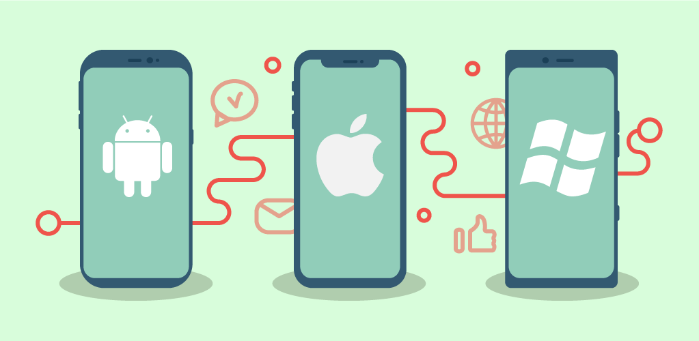
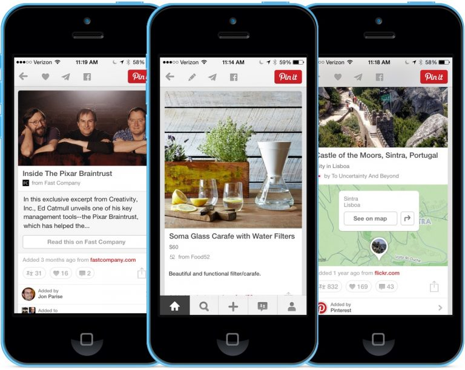
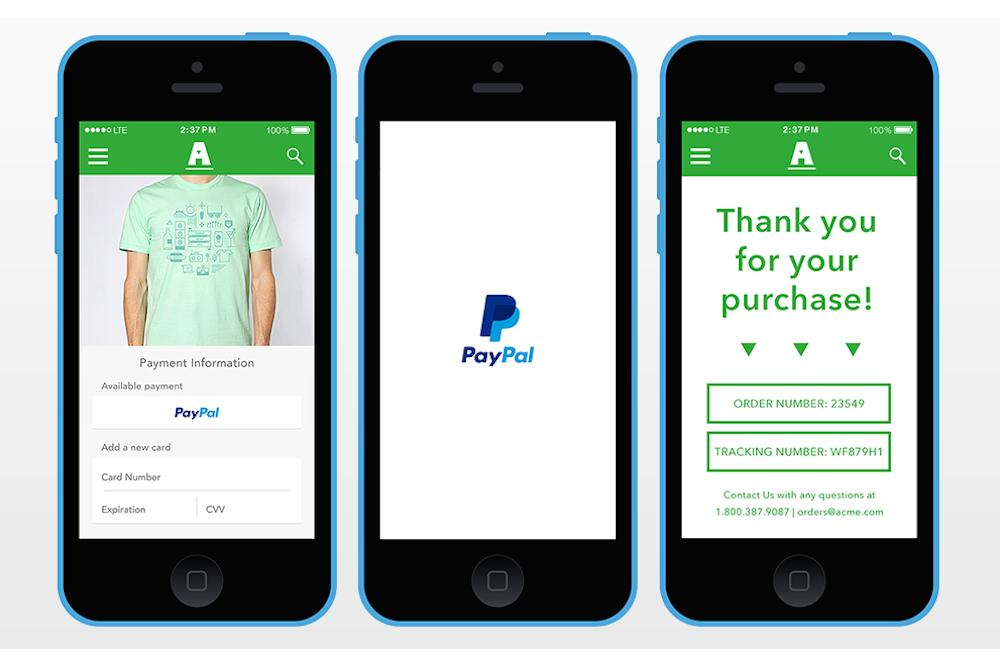
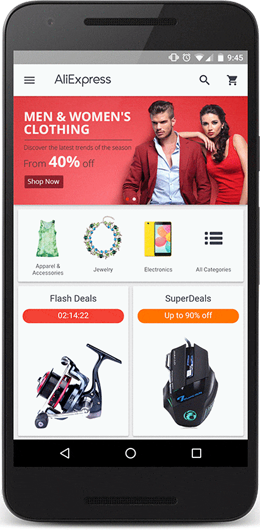
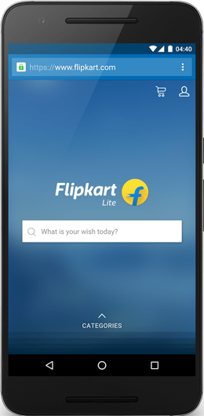
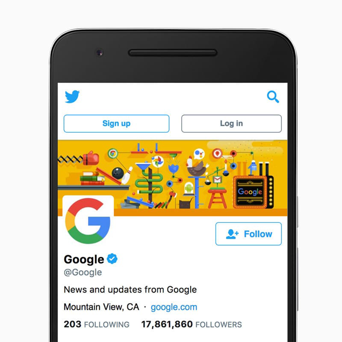
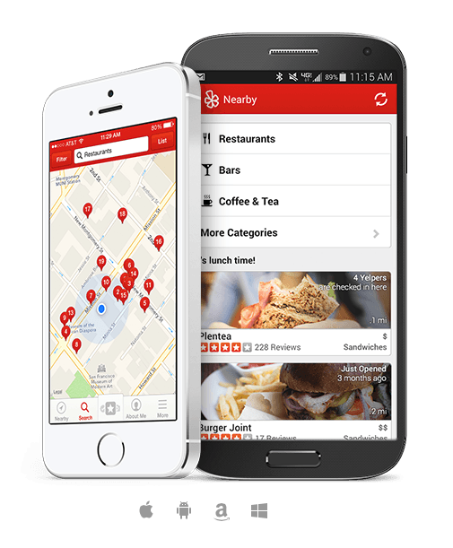
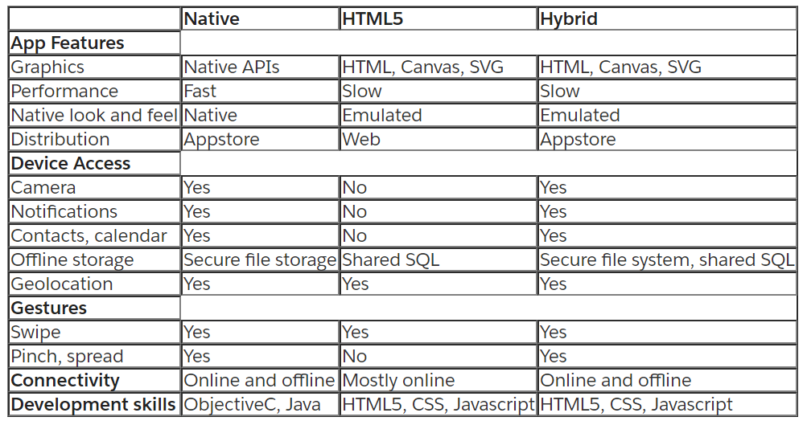

# Native Apps, Web Apps or Hybrid Apps? 

When talking about app development, we are usually talking about developing for mobile devices. More specifically, we’ll be focusing on one of the two biggest operating systems: iOS and Android first.

## iOS and Android

If you’re buying a new smartphone today, chances are very good that it will run Google’s Android or Apple’s iOS mobile operating systems. 

**iOS** is developed and supported by Apple and is used only on their own devices, iPhones and iPads. In other words, in the Apple universe, they control both the hardware and the software. Because of this, they can more closely control how their devices (and mobile apps on their devices downloaded from the iOS App Store) function, which enables them to maintain a loyal user base and a solid amount of market share.

**Android** is developed and supported by Google, often considered a more open platform compared to Apple. In fact, Android is an open source operating system, which means that a number of device makers can use Android on their devices. Google sells a few devices of its own, but many Android users are using devices built by other companies like Samsung, Huawei, LG, HTC, etc.

The good news is that both smartphone operating systems are excellent. They have far more in common than what divides them, but there are some important differences that you’ll want to consider. 

###  iOS vs Android

- Popularity    *Winner: Android*

As of 2018, Android controls about 88% of the mobile device market worldwide, and Apple owns most of the rest. The number of Android users has grown from 1.8 billion devices in September 2015 to 2.7 billion by the end of 2017.

- Affordability    *Winner: Android*

For sheer scale and variety, nothing competes with Android. You can spend a lot if you want to, for example, Google’s Pixel 2 phones and Samsung’s Galaxy Note line almost match Apple’s iPhone pricing, but there’s also a huge choice of low-cost handsets from a wide variety of different manufacturers and the platform has been deliberately optimized to run on low-end hardware. The fact that Android also leads the field in free apps makes it the natural choice for the budget-conscious.

- Apps    *Winner: iOS*

Traditionally, iOS has been a more lucrative platform for developers, so there has been a tendency for new apps to appear there first, but that is changing as Android’s market share continues to grow. In the U.S., iOS still leads the way, but developers elsewhere are increasingly targeting Android first. The Play Store still has a higher percentage of free apps than the App Store. But the best mobile games still land on iOS first and they don’t always come to Android. Ultimately, quality beats quantity and so this is a narrow win for iOS.

- Alternative app stores and sideloading    *Winner: Android*

It’s relatively easy to sideload apps on Android. Tick a box in the settings, download an APK and you’re set. There are also a lot of alternative Android app stores beyond the Play Store, but sideloading can open you up to the risk of malware. Apple is opposed to third-party app stores. If you want a wider choice of apps and easy sideloading then your choice is obvious.

- Battery life and charging    *Winner: Android*

Both Android and iOS allow you to see your battery usage at a glance, broken down by app, but only Android shows an estimate of how much battery life you have left. They both offer power saving modes that can extend your battery life by limiting performance, connectivity, and other power-sapping features, but precisely how it works is generally more customizable on Android.  For a long time, Android had an advantage in the charging department, because many Android phones offered fast charging capabilities and wireless charging. Comparing similarly priced Android phones with iPhones, they tend to have longer battery life and they always have fast chargers included in the box, so Android gets the win.

- Updates    *Winner: iOS*

Apple’s iOS offers consistent and timely software updates and security patches. If you want the same experience on Android, then you must buy one of Google’s Pixel phones.  If you want the latest features, bug fixes, and security updates, then you should choose iOS.

- Customizability    *Winner: Android*

This has always been one of Android’s main strengths. It’s very easy to theme your phone, you can set up the layout you want on your home screen, add widgets and shortcuts, and even change your entire user interface with launchers. You can set backgrounds in iOS and there’s limited support for widgets, but you don’t have anything like the same level of freedom. Android also allows you to set up third-party apps as your default options for many things that are still locked down in iOS. If you enjoy tinkering, or you want a truly unique, personalized look for your home screen, then Android is the platform for you.

- Cloud services    *Winner: Android*

Apple is still lagging when it comes to cloud storage and automatic backups. Google Drive offers 15GB for free and has cross-platform support. You only get 5GB with iCloud, and it only works with Windows, Mac, and iOS. If you need a lot of additional space, then Google Drive was the cheapest at $2 per month for 100GB ($24 for the year), but Apple dropped its prices to match. Apple charges $1 per month for 50GB. They both offer 1TB for $10 per month. Android’s cloud storage is easier to use and more effective than iCloud, though you can use Google Drive on an iPhone, whereas iCloud is iOS only.

- Security    *Winner: iOS*

There’s no denying that iOS is the most secure platform and the one that best protects user privacy. If you care about your privacy and security, go with an iPhone.

### Can iOS and Android apps work together?

Unfortunately not.

There isn’t any overlap between the apps of each of these devices. This means that native iOS apps won’t run on Android phones, and vice versa.

Even though you see Snapchat or Instagram, for example, running on both phones and looking very similar, they were actually built entirely separately.

Now that we’ve got the basics, let’s define native, web, and hybrid mobile apps.

- **Native apps** are specific to a given mobile platform (iOS or Android) using the development tools and language that the respective platform supports (e.g., Xcode and Objective-C with iOS, Eclipse and Java with Android). Native apps look and perform the best.

- **Web apps** use standard web technologies—typically HTML5, JavaScript and CSS. This write-once-run-anywhere approach to mobile development creates cross-platform mobile applications that work on multiple devices. While developers can create sophisticated apps with HTML5 and JavaScript alone, some vital limitations remain at the time of this writing, specifically session management, secure offline storage, and access to native device functionality (camera, calendar, geolocation, etc.)

- **Hybrid apps** make it possible to embed web apps inside a thin native container, combining the best (and worst) elements of native and web apps.

Now, let's talk about them in detail.

## Native Apps

### What is a Native App?

Native apps are what you would normally think about when you think about apps. A native application is a software program that is developed for use on a particular platform or device.

### How are Native Apps built?

Native apps are applications written in languages that the platform they are being built for accepts. For example, Swift or Objective-C is used to write native iOS apps, Java is used to write native Android apps, and C# for the most part for Windows Phone apps.

Apple and Google offer app developers their own development tools, interface elements and standardised SDK; Xcode and Android Studio. This allows any professional developer to develop a native app relatively easily.

### Advantages of Native Apps

- broad functionalities due to using the capabilities of the underlying device
- quality assurance though ratings in application stores
- Easy to tap into wider device functionality
- Push Notifications
- Match app UI/UX to platform conventions
- Fast and responsive because they are built for that specific platform
- Distributed in app stores
- They are more interactive, intuitive and run much smoother in terms of user input and output
- Internet connection is not required, although it depends on the functionality
- Overall better user experience. To the user, the flow is more natural as they have specific UI standards for each platform

### Disadvantages of Native Apps
- More than one codebase
- Native Apps can cost more, and take longer to build
- Difficult languages to learn which means you need experienced developers
- More expensive
- Not the best option for very simple apps

### Examples of Native Apps

The main disadvantage of native apps is having to develop apps separately for each platform you want to cover. That’s still true if you want to stick to the native SDKs provided by Apple and Google, but in the last few years, several alternatives have become available to reap the benefits of cross-platform development without sacrificing the user experience or access to native APIs. Two of such platforms that allow for cross-platform development are Xamarin and React Native.

- Xamarin
Made by Microsoft, Xamarin is a platform that lets developers build one app that works on multiple platforms in C#. They also provide free tools to build, test, distribute, and learn from your apps.

- React Native
Not wanting to be left out of the fight, in 2015 Facebook launched an open-source project of their own called React Native, which lets you build real, native iOS and Android apps with one codebase.

- Titanium
Titanium, in its latest version, is similar to React Native in that apps are written in Javascript, but produce a native application; bridging native APIs to Javascript with its own set of APIs.

## Web Apps

### What is a Web App?

A web app is an application that is accessed via a web browser over a network such as the Internet. Web apps, however, do not need to be downloaded from app stores like mobile apps. Web apps load in browsers like Chrome, Safari, or Firefox. A web app also doesn’t take up storage on the user’s device.

### How are Web Apps built?

Typically, web apps are built in JavaScript, CSS, and HTML5 and run inside a browser (Safari, Chrome, etc). There is no software development kit for developers to use, however, there are templates that developers can work with.

### Advantages of Web Apps

- Easy to build
- Easy to maintain
- An Inexpensive option
- Build one app for all platforms – iOS, Android, etc. as long as it can run a browser

### Disadvantages of Web Apps

- Needs a browser to run. Users have to take another step to type in the URL of the app which amounts to a poor user experience
- Much slower than native apps
- Web apps are less interactive and intuitive than native apps
- No icon on mobile desktop as you would if it was downloaded from the app stores
- Cannot leverage device utilities

### Examples of Web Apps

- AliExpress 
AliExpress is a popular e-commerce site owned by the Alibaba Group. A few years ago, they converted their mobile site to a Progressive Web App.

- Flipkart
Flipkart is India’s largest e-commerce site. They recently updated their mobile site to a Progressive Web App called Flipkart Lite.

- Twitter Lite
In 2017, Twitter rolled out its Progressive Web App “Twitter Lite” as the default mobile web experience for all users worldwide.

## Hybrid Apps

### What is a Hybrid Apps

A hybrid app is one that combines elements of both native and Web applications.  Hybrid apps are often mentioned in the context of mobile computing.

### How are hybrid mobile apps built?

Hybrid mobile applications are built in a similar manner as websites. Both use a combination of technologies like HTML, CSS, and JavaScript. However, instead of targeting a mobile browser, hybrid applications target a WebView hosted inside a native container. This enables them to do things like access hardware capabilities of the mobile device.

### Advantages of Hybrid Apps

- One codebase to manage

- You save time and money

- Easier to scale

- Built on web technology HTML/ CSS/ Javascript so it’s much easier to build
- Cheaper than a native app
- Improved UI/UX
- Offline Support
- Simplified Maintenance
- One app for all platforms using technology like Cordova
- Ease of Integration
- No browser needed as opposed to a web app
- Have access to the device’s internal APIs, can access storage, camera, etc.
- Faster to develop than native apps because you have a single code base

### Disadvantages of Hybrid Apps
- Performance

- Cross-platform development is tough

- The UX of the app will suffer

- Slower than native apps
- More expensive than standard web apps because you have to work with the wrapper. 

- Less interactive than native apps
- Customization will take you away from the hybrid model in which you may as well go native

### Examples of Hybrid Apps
-  Instagram
Instagram is a photo and video-sharing social networking service owned by Facebook, Inc. 

- Yelp
Yelp is a local-search service powered by crowd-sourced review forum, as well as an American multinational corporation headquartered in San Francisco, California. 

- Untappd
Untappd is a geosocial networking service and mobile phone application that allows its users to check in as they drink beers, and share these check-ins and their locations with their friends.

## How To Choose?

Mobile development is a constantly moving target. Every six months, there’s a new mobile operating system, with unique features only accessible with native APIs. The containers bring those to hybrid apps soon thereafter, with the web making tremendous leaps every few years. Based on current technology, one of the scenarios examined in this article is bound to suit your needs. Let's sum those up in the following table:

The decision to build either a web, native, or hybrid mobile app should be based on your business objectives. Before jumping into development, you should consider the following factors:

- How fast you need the app
- The quality of the user experience you want your app to have
- The complexity of the features you need for your app to work
- Your Budget

Whichever approach you choose should, above all, be quick, responsive, and reliable. As users are demanding more from mobile experiences, it’s important to keep up with their changing demands. Whichever app you decide to build, remember the following:

- Your API infrastructure should have reliable and easy access to your content and services
- A mobile app is not a replication of your website but an extension of your brand
- Always get an understanding of your users’ expectations and behaviors and adapt as the market demands change
- It’s important to work with an app development company that specializes in platform specific design and development.

Social networks need to wow users in order to get them to invite all their friends. If the app isn’t impressive or better than apps they’ve used before, there’s simply a lower chance that they will share the app. Keep that in mind when choosing your app technology.

## References

1. [Android vs. iOS: Which smartphone platform is the best?](https://www.digitaltrends.com/mobile/android-vs-ios/)
2. [native app](https://searchsoftwarequality.techtarget.com/definition/native-application-native-app)
3. [What is a Hybrid Mobile App?](https://developer.telerik.com/featured/what-is-a-hybrid-mobile-app/)
4. ["Native, HTML5, or Hybrid: Understanding Your Mobile Application Development Options"](https://developer.salesforce.com/page/Native,_HTML5,_or_Hybrid:_Understanding_Your_Mobile_Application_Development_Options)
5. [A Guide to Mobile App Development: Web vs. Native vs. Hybrid](https://clearbridgemobile.com/mobile-app-development-native-vs-web-vs-hybrid/)
6. [Mobile App Vs. Mobile Website: Which Is The Better Option?](https://clearbridgemobile.com/mobile-app-vs-mobile-website-which-is-the-better-option/)
7. [Difference? Which Do I Need?](https://www.upwork.com/hiring/mobile/native-app-vs-web-app-for-mobile/)
8. [11 Examples of Progressive Web Apps](https://themanifest.com/app-development/11-examples-progressive-web-apps)
9. [hybrid application (hybrid app)](https://searchsoftwarequality.techtarget.com/definition/hybrid-application-hybrid-app)
10. [Top 5 Benefits of Hybrid Mobile App Development](https://www.rishabhsoft.com/blog/advantages-of-hybrid-mobile-apps)