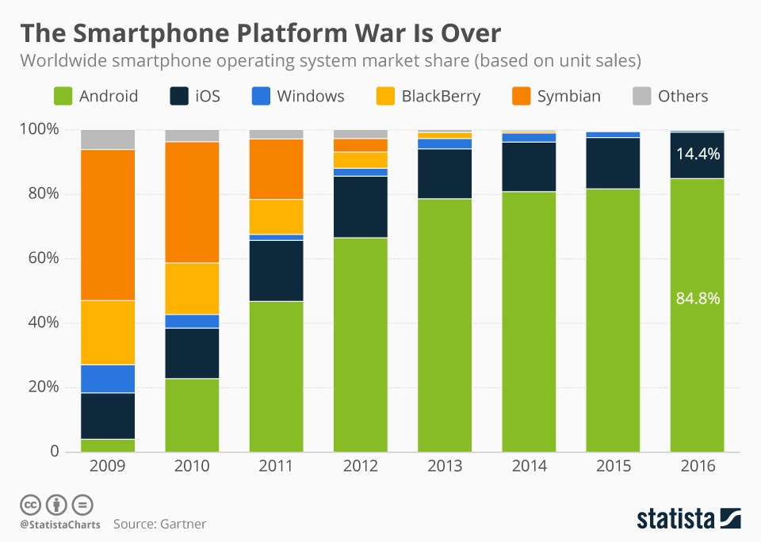
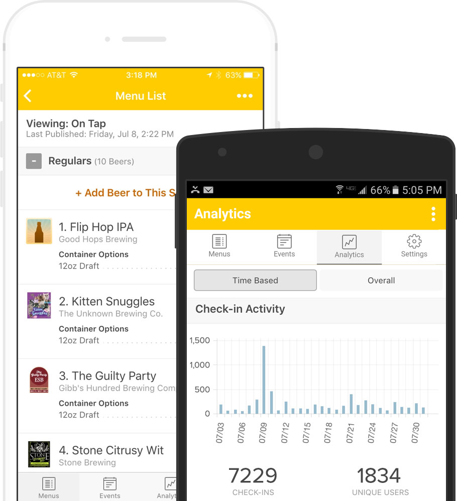
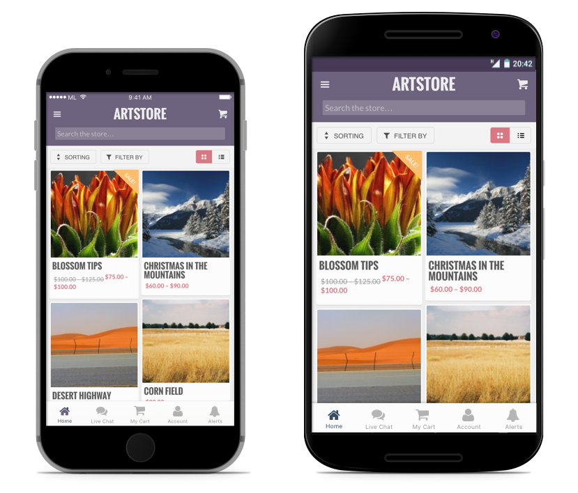

# Native Apps, Web Apps or Hybrid Apps? 

[TOC]

When talking about app development, we are usually talking about developing for mobile devices.

This includes smartphones, phablets, and tablets.

There are also apps for the web and wearables like smartwatches, but for the purposes of this article, we’ll stay within the bounds of mobile devices like phones and tablets.

More specifically, we’ll be focusing on one of the two biggest operating systems: iOS and Android.

## iOS and Android

### iOS vs Android

For the most part, most people’s mobile devices run on iOS and Android.

As of 2018, Android controls about 88% of the mobile device market worldwide, and Apple owns most of the rest. The number of Android users has grown from 1.8 billion devices in September 2015 to 2.7 billion by the end of 2017.

iOS is developed and supported by Apple and is used only on their own devices, iPhones and iPads. In other words, in the Apple universe, they control both the hardware and the software. Because of this, they can more closely control how their devices (and mobile apps on their devices downloaded from the iOS App Store) function, which enables them to maintain a loyal user base and a solid amount of market share.

Android is developed and supported by Google, often considered a more open platform compared to Apple.

In fact, Android is an open source operating system, which means that a number of device makers can use Android on their devices. Google sells a few devices of its own, but many Android users are using devices built by other companies like Samsung, Huawei, LG, HTC, etc.

### Can iOS and Android apps work together?

Unfortunately not.

There isn’t any overlap between the apps of each of these devices. This means that native iOS apps won’t run on Android phones, and vice versa.

Even though you see Snapchat or Instagram, for example, running on both phones and looking very similar, they were actually built entirely separately.

Now that we’ve got the basics, let’s define native, web, and hybrid mobile apps.

## Native Apps

### What is a Native App?

Native apps are what you would normally think about when you think about apps.

The majority of the apps on your smartphone are native applications, and they are built in a specific programming language, for the specific device platform, either iOS or Android.

### How are Native Apps built?

Unlike web apps that are written primarily in Javascript, native apps are applications written in languages that the platform they are being built for accepts. For example, Swift or Objective-C is used to write native iOS apps, Java is used to write native Android apps, and C# for the most part for Windows Phone apps.

Apple and Google offer app developers their own development tools, interface elements and standardised SDK; Xcode and Android Studio. This allows any professional developer to develop a native app relatively easily.

### Advantages of Native Apps

So why are most apps native? The reason is that native apps have a number of significant advantages over the alternatives.

- Fast and Responsive
Native apps offer the fastest, most reliable and most responsive experience to users.

This is unlikely to change in favor of web apps.

- Easy to tap into wider device functionality
Native makes tapping into the camera, microphone, compass, accelerometer and swipe gestures super easy.

It’s still possible using the alternatives, but it’s easiest on native.

- Push Notifications
Native apps can make use of push notifications, alerting users when their attention is required in the app.

You get the opportunity to continually bring your audience back for more, which is key to a successful app.

- Match app UI/UX to platform conventions
You’re more likely to please your users due to the way you can match each app’s UI/UX to the platform conventions.

There are dozens of UI/UX differences that make users feel at home. By building native, you don’t have to compromise with UI/UX that you hope will be user-friendly for all platforms.

### Disadvantages of Native Apps
- More than one codebase
iOS apps will not run on Android and vice versa, so you will have to work with different codebases for every platform you choose to build in.

- Native Apps can cost more, and take longer to build
Native apps generally cost more to make than hybrid apps.

Most developers specialize in one platform (Android or iOS), so to have your application developed on both platforms will require two separate developers (or teams), which can also add to time and cost.

### Examples of Native Apps
A large number of the most popular apps out there like Pokemon Go, Twitter, and Waze, are fully native.

It’s become trickier, however, to distinguish who’s using purely native code on Swift, Objective C and Java and who’s relying on hybrid solutions or cross-platform SDKs.

- Building Cross-Platform Native Apps
As we said, the main disadvantage of native apps is having to develop apps separately for each platform you want to cover.

That’s still true if you want to stick to the native SDKs provided by Apple and Google, but in the last few years, several alternatives have become available to reap the benefits of cross-platform development without sacrificing the user experience or access to native APIs.

Two of such platforms that allow for cross-platform development are Xamarin and React Native, both worth a look.

- Xamarin
Made by Microsoft, Xamarin is a platform that lets developers build one app that works on multiple platforms in C#. They also provide free tools to build, test, distribute, and learn from your apps.

Xamarin feels like a more complete development environment than PhoneGap and Titanium, even offering a test environment where you can test your app on thousands of virtual devices before launching (this is crucial for cross-platform apps).

Xamarin also offers a few prebuilt apps you can use to get a quick start. Some companies that have built apps with Xamarin include Slack, Pinterest, and Honeywell.

- React Native
Not wanting to be left out of the fight, in 2015 Facebook launched an open-source project of their own called React Native, which lets you build real, native iOS and Android apps with one codebase.

It’s not a “mobile web app”, a “HTML5 app”, or a “hybrid app”. With React Native you can build a real mobile app that’s indistinguishable from an app built using Objective-C or Java.

You just use JavaScript and React to put it together.

These stats from Instagram show that for the features they built with React Native the amount of code shared between iOS and Android was over 90%!

While React Native doesn’t give you access to all the device’s functionality, you can weave in native code if you need to.

There are some pretty heavy-hitters using React Native, including Facebook, Walmart, Tesla, and Airbnb. You can check out some React Native apps here.

- Titanium
Titanium, in its latest version, is similar to React Native in that apps are written in Javascript, but produce a native application; bridging native APIs to Javascript with its own set of APIs.

It no longer relies on webviews and this results in a more “native” look and feel for your app.

Titanium has a great showcase of apps built with their technology on their website. Some of the more well-known apps built using Titanium are eBay, ZipCar, PayPal, and Khan Academy.

## Web Apps

According to Wikipedia, a web app “is an application that is accessed via a web browser over a network such as the Internet.”

So how is a Web App different to a Website?

The difference is subjective, but most would agree that a website will generally just be informational and a web app provides additional functionality and interactivity. For example, Wikipedia is a website; it provides information. Facebook is a web app that is more interactive.

Don’t let the word “app” confuse you, though. Web apps don’t need to be downloaded like mobile apps do.

Web apps load in browsers like Chrome, Safari, or Firefox and they don’t take up any memory or storage on the user’s device.

### How are Web Apps built?
The vast majority of Web Apps are built in JavaScript, CSS, and HTML5.

Unlike an iOS or Android app, there is no software development kit (SDK) for a developer to work with.

There are templates and frameworks like Angular, React, and Vue.js that you can use to get a quick start.

As opposed to mobile apps, developing a web app can be simple and quick (it can also be complicated, depending on your demands from it!).  It’s often a good way to test out an idea before investing in a native mobile app. However, if your web app is relatively simple and designed for desktop users over mobile, you may miss out on mobile traffic, engagement, and revenue opportunities.

Mobile traffic had already surpassed desktop traffic by the end of 2016, so developing for desktop usage first may not always be the right solution, particularly if parts of your business revolve around publishing content.

Read more on the benefits of a mobile optimized website.

### Progressive Web Apps
Until recently, web apps lacked the functionality of native apps, like the ability to send push notifications, work offline, and load on the home screen.

However, there have been a few improvements to browsers and web apps that offer these features. Apps that take advantage of these features are called Progressive Web Apps (PWAs).

There are a few steps you need to take in order to turn your web app into a progressive web app. They go beyond the scope of this article, but you can find a comprehensive guide here.

### Are Progressive Web Apps the way to go?
It depends what your goal is.

They only work on Google Chrome which is fairly limiting. If your goal is to cover an audience on Android and iOS, then progressive web apps are probably not for you.

In that sense, they are not a substitute for a mobile app but they can be a way to quickly get a mobile-app-like web app into people’s hands.

If you were considering converting your web app into a progressive web app, consider instead using a solution like Canvas. This turns your web app into a mobile app- hassle free.

We also created a comparison guide on how Progressive Web Apps compare to Native Apps – you can read that here!

## Hybrid Apps

If a native app and a web app got married and had a kid, it would be a hybrid app.

You install it like a native app, but it’s actually a web app on the inside.

Hybrid apps, like web apps, are built with Javascript, HTML, and CSS and run in something called Webview, a simplified browser within your app.

### Why Hybrid?
Say you have an idea for an app and you don’t know if people will like it or not.

Your goal is to put something usable into their hands as quickly as possible. You’re short on resources, so you need to create a simple version of your product that still provides value.

In the startup world, this is called an MVP, or minimum viable product.

Building a web app might be the truly minimal option, but it won’t really allow you to test whether people will download and use an app on their device.

A hybrid app offers a solution to this.

### Advantages of Hybrid Apps
- One codebase to manage
All the advantages of hybrid apps stem from the fact that, instead of building two apps, you’re building one app and simply tweaking it a bit so it works on both platforms.

With a hybrid app, you only have one codebase to manage.

- You save time and money
As you only have to manage one codebase, you’ll probably require half the number of developers two native apps would have required. Or, with the same number of developers, a hybrid app could be published in half the time.

In addition, hybrid app developers are often less expensive than native app developers.

- Easier to scale
Hybrid apps are easier to scale to another platform. Once you’ve built for one platform, you can launch on another like Windows Mobile.

You still have access to device features
As with native apps, hybrid apps let you retain the same ability to access device features.

This is thanks to solutions like PhoneGap that act like a bridge between the native SDK and the webview in which the app runs. We’ll talk about PhoneGap below.

### Disadvantages of Hybrid Apps
- Performance
Performance is probably the biggest disadvantage of hybrid apps.

Because hybrid apps load in a browser-like component called webview, they are only as good as the webview. Webview is responsible for displaying the UI and for running Javascript code.

In the early days of mobile, Google and Apple didn’t give webview the same engines used by their mobile browsers, Chrome and Safari. Since then, webview has vastly improved but it hasn’t reached native performance yet.

We will get deeper into different aspects of performance later in the article.

- Cross-platform development is tough
Getting your hybrid app to run appropriately on each platform generally takes substantial work.

In some situations, the total cost might become comparable to that of fully native apps, rendering the cost benefits negligible.

It all depends on how close you want to get to the “native user experience” or how simple your app is.

- The UX of the app will suffer
iOS and Android users tend to be very loyal to their platforms, and since they’ve been using them for years, they’re used to how things work in native apps.

The differences are subtle but can be frustrating for your app users.

By building a hybrid app, you won’t be able to please both camps. Try too hard to customize the app based on the platform and it may end up costing the same as two native apps.

There are some ways you can do this which we will discuss shortly.
### Hybrid App Platforms
- PhoneGap/Cordova
PhoneGap is probably the most well known among hybrid app platforms and probably the easiest to begin with for a web developer.

Cordova is the open source foundation and engine of PhoneGap. It’s backed by Adobe and is completely open source.

Cordova lets you create cross-browser mobile applications with Javascript, HTML, and CSS. These apps run in a WebView and are then wrapped in native code.

PhoneGap then offers native plugins that allow you to use all of the device’s functionality including the accelerometer, camera, compass, file system, microphone, media, networks, notifications, geolocation, and storage.

Apps need to be packaged into binary files which will include a webview wrapper and your app’s HTML files, normally loaded locally on the device.

Check out these PhoneGap apps: Tripcase (iOS / Android) and Untappd

- Canvas
Our own take on the hybrid app, Canvas is a service offering anyone with a mobile web app or responsive site the ability to build a mobile app for it, with no development work.

As with our News solution, Canvas is offered as a service, meaning we will build, publish and maintain your apps for you.

Technically, Canvas relies on our own native codebase for iOS and Android, including native elements for navigation such as a tab bar, a push notifications inbox, content preloading for your pages, caching, and offline support.

The app is designed to rely on a remote web app or mobile website which you control – any change on your mobile website is immediately reflected in the app. It’s a cost effective and high quality option for creating a mobile app for your website.

## How To Choose?
We’ve given you a list of the advantages and disadvantages of web, native and hybrid mobile apps.

But how do you decide which one is best for you?

The following is a list of factors that should help you decide what kind of app to build.

- User Experience
User Experience (UX) is the overall experience a user has when using your product, especially in terms of how easy or pleasing it is.

A user interface is like a joke. If you have to explain it, it’s not that good. And if your app has bad UX, people will stop using it.

Needless to say, you need to invest in UX.

The best possible thing you can do for UX is to write two separate native apps for iOS and Android. Like we mentioned earlier, there are differences between the two operating systems and people have gotten used to them. If you hand an Android phone to a loyal iPhone user, chances are they’ll stumble a bit, and vice versa.

To see a list of the major differences between iOS and Android, click here.

- Time to market and cost
How much does building an app cost? There’s obviously a large range here. Prices will vary based on complexity, features, and platforms.

A quick way to get an estimate is to use this tool created by the fine people at Crew.  It asks a number of questions and gives you an estimate of how much your app will cost.

But essentially, your app development cost can be determined by just 2 factors: hours required to build and hourly cost. The hourly cost will stay mostly the same and is easy to determine, but the number of hours the app requires depends on what you need the app to do. Some of the major features you might need are covered in the tool created by Crew.

The best data about app development costs comes, unsurprisingly, from app development agencies. One such agency is The Nine Hertz. In 2016, they released this handy infographic.

There are a few important data points here so let’s go through them.

There are many different directions in which you can take your app, all of which have their pros and cons.

There will always be some kind of limitation of time or money that will push you to make a certain decision about your app.

What’s important is to spend enough time thinking and calculating before you start building.

Apps are expensive enough that you may only have one go at getting it right. Read as much as you can about the different kinds of apps and the development stages.

If you can, get in touch with people that have gone through the process of building each of these kinds of apps. They will be able to give you the best opinions.

What is clear, though, is that commercial success of smartphones and tablets isn’t showing any signs of slowing down.

So in the next few years, you can expect billions of people around the world to be getting their first smartphone.

The opportunity to get your app into the app store and into the hands of millions (or even billions) of people is still growing. Take it!

Now you have a better idea of how to build your app, let us take you through the app-building process – from market research to launch.