# Native Apps, Web Apps or Hybrid Apps? 

[TOC]

When talking about app development, we are usually talking about developing for mobile devices.

This includes smartphones, phablets, and tablets.

There are also apps for the web and wearables like smartwatches, but for the purposes of this article, we’ll stay within the bounds of mobile devices like phones and tablets.

More specifically, we’ll be focusing on one of the two biggest operating systems: iOS and Android.

## iOS and Android

If you’re buying a new smartphone today, chances are very good that it will run Google’s Android or Apple’s iOS mobile operating systems. These two platforms accounted for more than 99 percent of all new smartphones shipped in 2016, and that rose to 99.7 percent last year, according to IDC. Microsoft has thrown in the towel with Windows Phone, BlackBerry makes Android devices now, and there are very few other options worth considering.

Google's **Android** and Apple's **iOS** are operating systems used primarily in mobile technology, such as smartphones and tablets. Android, which is Linux-based and partly open source, is more PC-like than iOS, in that its interface and basic features are generally more customizable from top to bottom. However, iOS' uniform design elements are sometimes seen as being more user-friendly.

The good news is that both smartphone operating systems are excellent. They have far more in common than what divides them, but there are some important differences that you’ll want to consider. We’re going to pit Android against iOS in several categories here and pick a winner for each one. Ultimately, the best platform for you depends on you. Pick the things that matter most to you, count the wins in those categories, and you have a recommendation.

###  iOS vs Android

For the most part, most people’s mobile devices run on iOS and Android.

As of 2018, Android controls about 88% of the mobile device market worldwide, and Apple owns most of the rest. The number of Android users has grown from 1.8 billion devices in September 2015 to 2.7 billion by the end of 2017.

iOS is developed and supported by Apple and is used only on their own devices, iPhones and iPads. In other words, in the Apple universe, they control both the hardware and the software. Because of this, they can more closely control how their devices (and mobile apps on their devices downloaded from the iOS App Store) function, which enables them to maintain a loyal user base and a solid amount of market share.

Android is developed and supported by Google, often considered a more open platform compared to Apple.

In fact, Android is an open source operating system, which means that a number of device makers can use Android on their devices. Google sells a few devices of its own, but many Android users are using devices built by other companies like Samsung, Huawei, LG, HTC, etc.

#### Affordability

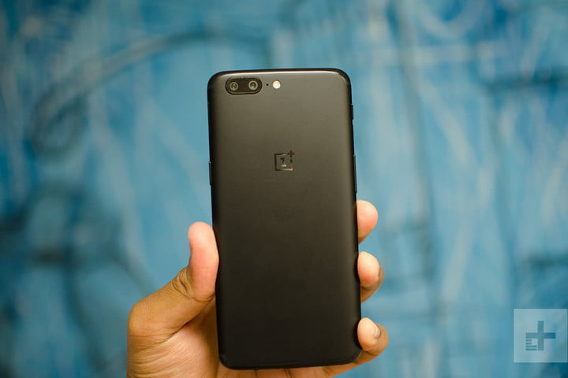

Apple has always been at the top end of the market in terms of pricing, but the iPhone X took things to a whole new level with a starting price of $1,000. The iPhone 8 Plus starts from $800 and the iPhone 8 from $700. If you don’t want to spend that much, then you can go for the 2-year-old iPhone 6S at $450 or the diminutive iPhone SE at $350. That’s as cheap as it gets unless you delve into the secondhand market.

For sheer scale and variety, nothing competes with Android. You can spend a lot if you want to, for example, Google’s Pixel 2 phones and Samsung’s Galaxy Note line almost match Apple’s iPhone pricing, but there’s also a huge choice of low-cost handsets from a wide variety of different manufacturers and the platform has been deliberately optimized to run on low-end hardware. The fact that Android also leads the field in free apps makes it the natural choice for the budget-conscious.

Winner: Android

#### Apps

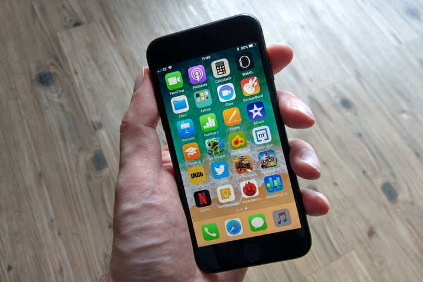

Let’s start with a look at the numbers. This is roughly how many apps you’ll find in the Google Play Store and the Apple App Store:

- Android apps: 3.5 million
- iOS apps: 2.2 million
Truthfully, numbers aren’t the best metric because most of us only use a handful of apps and the most popular ones are available on both platforms. Traditionally, iOS has been a more lucrative platform for developers, so there has been a tendency for new apps to appear there first, but that is changing as Android’s market share continues to grow. In the U.S., iOS still leads the way, but developers elsewhere are increasingly targeting Android first.

The Play Store still has a higher percentage of free apps than the App Store. But the best mobile games still land on iOS first and they don’t always come to Android. Ultimately, quality beats quantity and so this is a narrow win for iOS.

Winner: iOS

#### App Store

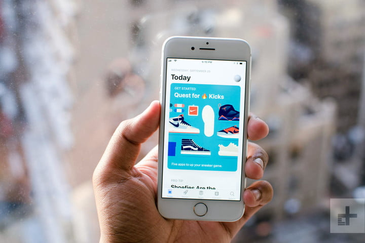

It’s difficult to organize millions of apps and games and neither Google’s Play Store or Apple’s App Store does it perfectly. Overall, we think Apple’s redesigned App Store in iOS 11 provides a better browsing experience on your phone and does a better job with curated recommendations. The Play Store is easier to search and you can queue and install apps from the web browser on your PC or laptop.

We like the fact that you can buy apps using your fingerprint via TouchID on iPhones, but you can set up the same thing for the Play Store on Android phones with fingerprint sensors. The Play Store wins points for having a no quibble refund policy within 2 hours of purchase. There are some questionable apps in both stores, but Apple is generally stricter about blocking certain types of apps. That can be a good thing for overall quality, but it’s a bad thing if you’re into something like game emulators for classic consoles. The App Store edges the win for usability and curated content.

Winner: iOS

#### Alternative app stores and sideloading
It’s relatively easy to sideload apps on Android. Tick a box in the settings, download an APK and you’re set. There are also a lot of alternative Android app stores beyond the Play Store, but sideloading can open you up to the risk of malware. Apple is opposed to third-party app stores. If you want a wider choice of apps and easy sideloading then your choice is obvious.

Winner: Android

#### Battery life and charging

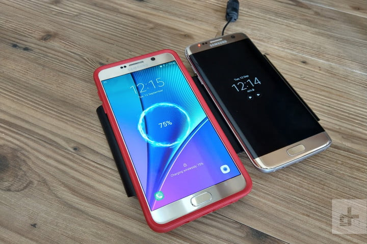

As one of the biggest bugbears for smartphone owners, battery life is a huge factor. It’s difficult to compare the two platforms because there’s no common hardware. We could say iOS is optimized to squeeze the most out of the battery per mAh rating, but you can buy an Android device with a much bigger battery that will easily outlast the iPhone.

Both Android and iOS allow you to see your battery usage at a glance, broken down by app, but only Android shows an estimate of how much battery life you have left. They both offer power saving modes that can extend your battery life by limiting performance, connectivity, and other power-sapping features, but precisely how it works is generally more customizable on Android.

For a long time, Android had an advantage in the charging department, because many Android phones offered fast charging capabilities and wireless charging. However, Apple’s iPhone 8, 8 Plus, and iPhone X all offer wireless charging and fast charging. It’s worth noting you have to buy the fast charging adapter separately, whereas it’s usually provided in the box with an Android phone.

This category is far from clear cut, but comparing similarly priced Android phones with iPhones, they tend to have longer battery life and they always have fast chargers included in the box, so Android gets the win.

Winner: Android

#### Updates

Apple’s iOS offers consistent and timely software updates and security patches. If you want the same experience on Android, then you must buy one of Google’s Pixel phones. This is how iOS version share breaks down according to Mixpanel research:

iOS 11: 89.82 percent
iOS 10: 7.18 percent
Older: 3 percent
Almost 90 percent of all iOS devices are now running the latest version. By contrast, only 0.5 percent of Android devices are running the latest Android 8.1 Oreo. This is how Android breaks down according to the official Android Developer website:

Android 8.1 Oreo: 0.8 percent
Android 8.0 Oreo: 4.9 percent
Android 7.1 Nougat: 8.2 percent
Android 7.0 Nougat: 22.9 percent
Android 6.0 Marshmallow: 23 percent
Android 5.1 Lollipop: 17.6 percent
Android 5.0 Lollipop: 4.8 percent
Android 4.4 KitKat: 10.3 percent
Older: 5 percent
If you want the latest features, bug fixes, and security updates, then you should choose iOS.

Winner: iOS

#### Customizability

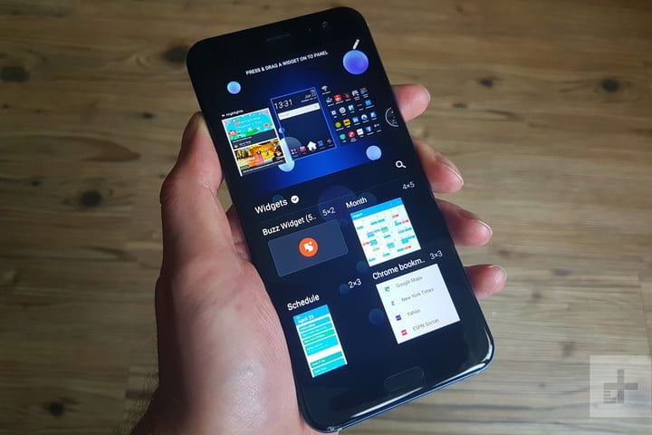

This has always been one of Android’s main strengths. It’s very easy to theme your phone, you can set up the layout you want on your home screen, add widgets and shortcuts, and even change your entire user interface with launchers.

You can set backgrounds in iOS and there’s limited support for widgets, but you don’t have anything like the same level of freedom. Android also allows you to set up third-party apps as your default options for many things that are still locked down in iOS. If you enjoy tinkering, or you want a truly unique, personalized look for your home screen, then Android is the platform for you.

Winner: Android

#### Accessibility

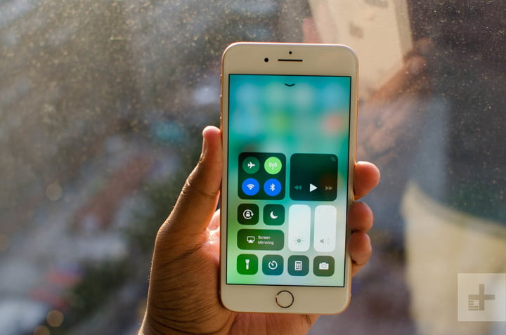

The perception that Android is more complicated than iOS prevails, but there’s no need to dive into customization options if you don’t want to. Both platforms offer a good range of accessibility features.

If you’re looking for a device for an elderly relative, or a technophobe then you’ll find some specialist offerings on Android, but they tend to scale down what’s possible. Manufacturers like Samsung also include options like “Easy mode” which make the interface bigger and simplify the whole experience, or you can opt for a third-party app to do the same. There are lots of good apps aimed at the elderly on Android and iOS.

Ultimately, iOS is simpler and easier to use in some important ways. It’s uniform across all iOS devices, whereas Android is slightly different on devices from different manufacturers. We also think iOS is less cluttered and more streamlined than most Android phones, although Google’s stock Android is every bit as elegant and accessible.

Winner: iOS

#### Calls and messaging

Basic calling and messaging functionality is good on both platforms, but it can be confusing on Android. Google appeared to be folding everything into Hangouts, which allows messages, SMS, video chat, group chat, and more via Wi-Fi or your data network, but then it somewhat confusingly released Allo and Duo. There’s also Android Messages, which used to be called Google Messenger, and it’s the default texting app. To make matters worse, you’ll find many manufacturers like to offer their own alternatives. Many Android phones come with their own messaging and dialer apps in addition to Google’s messaging apps, or they eliminate the Google apps. It looks as though Chat, based on the new Rich Communication Services (RCS) messaging standard will unify things, but it will be a while before it’s available on all Android phones.

FaceTime and iMessage come pre-installed on every iPhone and iPad, so it’s remarkably easy to connect with your friends and family. While iMessage is very easy to use, it works best when communicating with other iPhone users. You’ll find third-party app integration, fun stickers, GIFs, and much more in iMessage. We give iOS the win for its consistency and ease of use.

Winner: iOS

#### Email

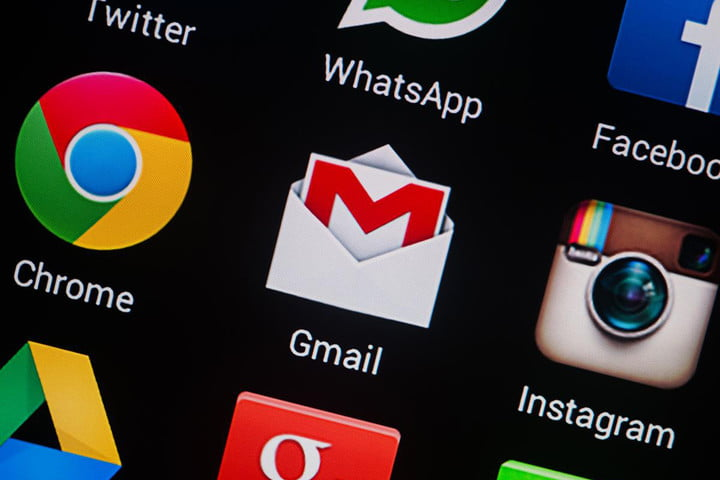

The default email apps on Android and iOS are very easy to use and quick to set up. You can pull in multiple email accounts and view them in a single inbox if you desire. Android and iOS have a huge range of third-party email apps available as well. However, Gmail is a stronger default email app than iOS’ Mail. Since Gmail is the most popular email address system in the world, it makes sense that the Gmail app would be a winner. You can also add email addresses from different providers in Gmail with ease.

The only issue is that Android phones often offer alternative email apps made by the manufacturers, which may or may not be good.

Winner: Android

#### Maps

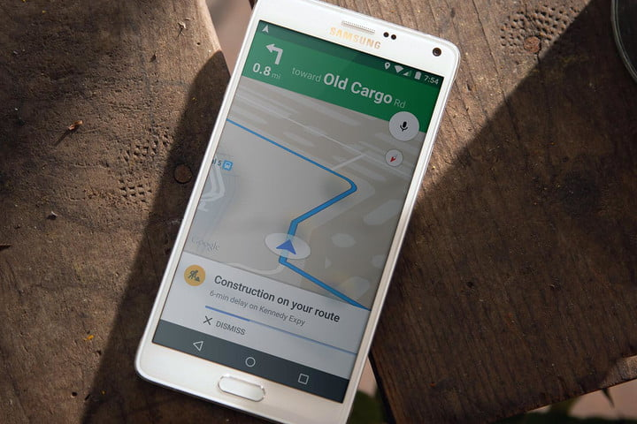

As the newer navigation system, Apple Maps did not have a great start, but it has improved significantly. Key features are similar, you can download maps for offline use, get accurate estimates based on current traffic conditions, and find turn-by-turn directions for driving or walking. You’ll also find public transit and ride-booking integration. They all work well and should get you where you’re going.

One thing that Google Maps offers that Apple Maps doesn’t is cycling directions. Overall, the scale and quality of Google Maps is unsurpassed. It has more points of interest and it is generally more detailed than Apple Maps, but the accuracy can vary from place to place. Given the choice we’d always pick Google Maps and, though you can get it on iOS, it’s better on Android because it’s the default navigation app.

Winner: Android

#### Camera

This is a difficult category to call. In the past, we’ve argued that Apple does the best job capturing lighting, coloring, and other details, but the latest Android smartphones are casting a lot of doubt on that assertion. Google’s Pixel 2 and Pixel 2 XL boast the best cameras we’ve used so far, but the iPhone 8 Plus and iPhone X come close.

While most of the current crop of Android flagships sport good, or sometimes great, cameras, there’s a fair bit of variance and the camera quality of many mid-rangers doesn’t come close to the quality of iPhone cameras. As you’d expect, most budget Android phones have lower quality cameras.

The camera apps on both platforms are very good and very fast. For ease of use and best results without tweaking, the iOS camera app takes the cake. There’s more variation on Android simply because OEMs tend to add their own camera apps with lots of features, some good, some a bit gimmicky. We’re going to give this one to iOS, but with the caveat that the top Android phones, particularly the Pixel 2, offer the best smartphone camera experience around.

Winner: iOS

#### Photo backup

If you use the Photos app in Android, then you can automatically back up all your photos and videos. There’s no doubt that Google Photos is the best option because it offers unlimited free storage, provided you don’t mind the 16-megapixel limit for images and the 1080p resolution limit for video.

You can back up photos and videos at the original resolution with iCloud or Google Photos, but you only get 5GB of free space with iCloud, compared to 15GB with Google Drive. You can also back up unlimited photos and videos in full resolution with Google Photos if you own a Google-branded Pixel phone.

This category is complicated by the fact that the default on iOS is iCloud, but you can also use Google’s Photos on iOS. However, since most people go with the default option, we’re giving Android the win here.

Winner: Android

#### Cloud services

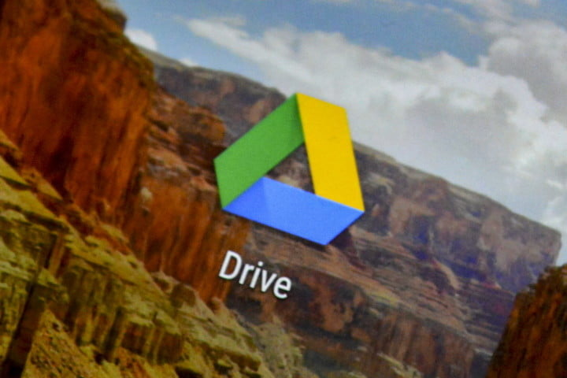

Apple is still lagging when it comes to cloud storage and automatic backups. Google Drive offers 15GB for free and has cross-platform support. You only get 5GB with iCloud, and it only works with Windows, Mac, and iOS.

If you need a lot of additional space, then Google Drive was the cheapest at $2 per month for 100GB ($24 for the year), but Apple dropped its prices to match. Apple charges $1 per month for 50GB. They both offer 1TB for $10 per month.

Android’s cloud storage is easier to use and more effective than iCloud, though you can use Google Drive on an iPhone, whereas iCloud is iOS only.

Winner: Android

#### Voice assistants

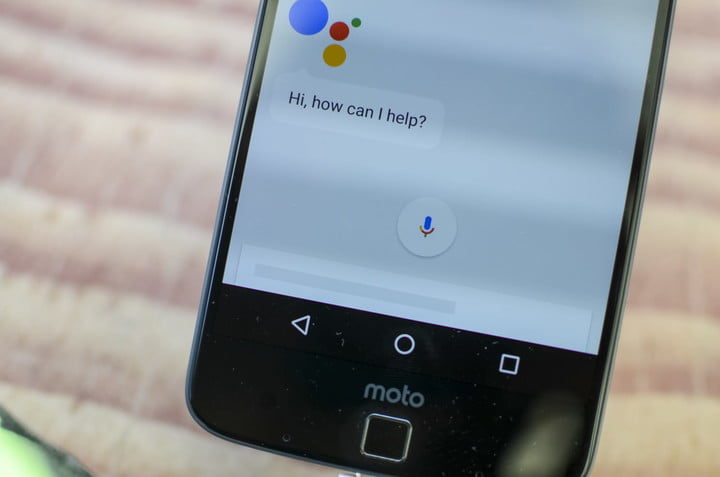

You can do many of the same things with Apple’s Siri as you can with Google Assistant, but Siri is more like a straightforward helper for setting calendar appointments, searching the web, or making calls. Google Assistant has an extra layer. It can pre-emptively offer useful suggestions, and it has a more conversational side that offers up entertaining games and contextual information based on what you’re doing. It’s smarter and more versatile than Siri.

The addition of Siri Shortcuts in iOS 12, allowing you to set up voice commands to trigger groups of automated tasks, is a big step in the right direction and Siri is also beginning to make more suggestions based on your iPhone usage, but for now, Google Assistant can do more.

Winner: Android

#### Security

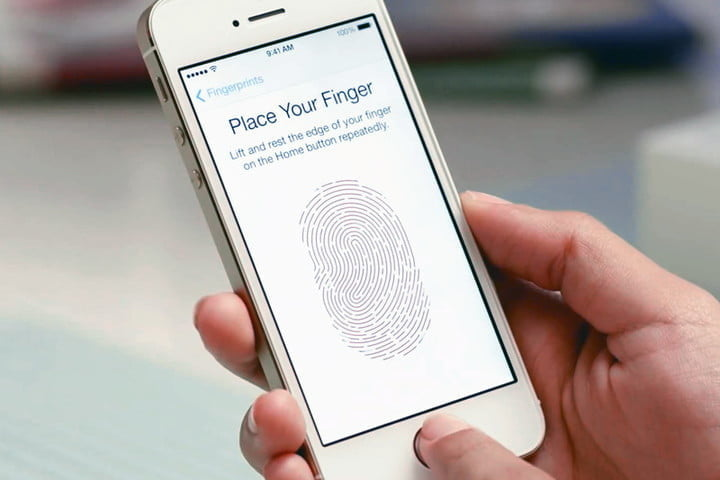

Much has been made of the supposedly “toxic hell stew” that is Android, but the threat of malware is exaggerated. The truth is that most people will never encounter a problem because they don’t go outside the Play Store for apps. Specific manufacturers like Samsung have taken extra efforts to beef up security for the enterprise market. But the slovenly nature of updates on many Android devices can seriously delay important security patches.

Speedy updates are now more important than ever because security breaches are becoming more serious. Android is behind in the update world, unless you have a stock Android device, and so it’s less secure. Because millions of Android phones are still running software that’s years old they can be vulnerable to serious hacks like Heartbleed and Stagefright.

Apple is already firmly entrenched in corporate America and has also worked on improved security for general consumers, most notably with Touch ID and FaceID in the iPhone X. The tight oversight that Apple has on apps and the ability to push updates out to more devices, more quickly, gives it a definite edge over Android. The company also encrypts data in iMessage and its other apps.

Apple prioritizes user privacy, so you can feel safe knowing your personal data is not stored or read by Apple. It is all encrypted, too. Meanwhile, Android encrypts some data, but your privacy is less protected. Google mines your data for information that it can use to sell better ads and market products to you. Your data is also stored and read to provide you with a better AI experience.

Google claims it’s committed to fully protect user privacy and still provide the AI services it offers, but some security experts and Apple argue that Google presents a false choice between privacy and AI. Apple even went to war with the FBI to guarantee your right to encryption. It’s hard to beat that kind of dedication.

There’s no denying that iOS is the most secure platform and the one that best protects user privacy. If you care about your privacy and security, go with an iPhone.

Winner: iOS

#### Rooting, bootloaders, and jailbreaking

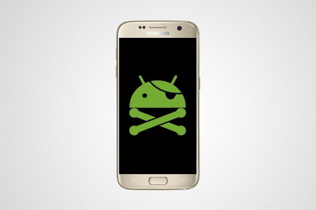

We’ve looked at how to root your Android phone or tablet before. It’s not for everyone, but if you want root access and complete control over your device, then rooting is the way to get it. Rooting gives you access to more apps, the latest OS updates without waiting, new software skins to get the aesthetic you want, the chance to get rid of bloatware from carriers and manufacturers, potential tweaks to boost your device’s speed and battery life, and more.

Many Android OEMs (original equipment manufacturers) also offer a way to unlock the bootloader, which determines how the operating system loads up on your device. Apple is completely opposed to this kind of thing. Jailbreaking is an option for iOS, which lets you download and install apps from outside the App Store and bypass some other limitations.

Winner: Android

#### Cases and accessories

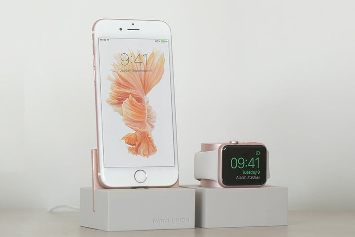

The average iPad or iPhone owner spends more money on more things than the average Android device owner, and Apple has built up a great ecosystem of peripherals for its phones and tablets. There are far more peripherals and cases aimed at the iPhone than any other device, but something like Samsung’s Galaxy S9 would be a close second.

On the other hand, Android devices have adopted the Micro USB or USB-C standard, whereas Apple insists on its proprietary Lightning cable, which means it’s much easier to find a charger if you’re not an iPhone owner. This often means you have to splash out on an overpriced Apple adapter. Peripheral manufacturers may still go after iOS as their main target, but it’s very rare to find something without Micro USB or USB-C support.

Another mark against Apple here relates to its abandonment of the standard 3.5mm audio port, which started with the iPhone 7 and iPhone 7 Plus. You do get an adapter in the box, but it’s easily lost and the choice of headphones sporting 3.5mm audio jacks far exceeds those with Lightning connectors. Of course, now some Android phones are axing the headphone jack in favor of USB-C audio, so this may not be a difference for much longer.

It’s also important to note that Apple’s ecosystem of products all work together exceedingly well. The iPad, Apple Watch, MacBook, and HomeKit products all work together in perfect harmony. MacOS, WatchOS, and iOS are all well connected, making it easy to have all Apple products on the same page.

Since Android phones are produced by many different manufacturers, product ecosystems vary. Samsung has a great ecosystem, for example, and Android phones have support from Home, Chromecast, and Android Wear. However, it’s not quite as seamless.

Overall, taking all available accessories into account, you have more choice with an iPhone, so iOS takes the win here, but with caveats.

Winner: iOS

#### Conclusion

Numerically speaking, Android wins 10 categories and iOS wins 8 categories, but iOS wins in some of the more important categories — we don’t think rooting or alternative app stores are as important for most people as accessibility or security, for example. It’s very difficult to compare the two. Because Apple controls the hardware and the software, you’ll find that iOS offers a more uniform experience across devices.

A straight comparison of the latest versions of Android and iOS wouldn’t be very representative of most people’s experience, because most Android devices aren’t running the latest version. The experience you get is further complicated by the fact that most Android smartphone manufacturers add their own user interface on top of Google’s stock Android. As a result, there’s quite a big difference between using Google’s Pixel 2, the Samsung Galaxy S9, and the LG G7 ThinQ, for example.

If you do decide to go with an Android device, make sure you do a little research and look at the version of Android it runs, the manufacturer skin on top, and the manufacturer’s record for software updates.

Ultimately, different categories will be important to different people, so you should pay attention to the ones that count for you and make your decision based on that. If security and privacy are an important factor, then the iPhone is the obvious choice. If battery life is top of your list and you want to be able to customize your phone, then choose Android. Both Android and iOS are mature, feature-packed platforms with far more similarities than differences, and we can heartily recommend either.

### Can iOS and Android apps work together?

Unfortunately not.

There isn’t any overlap between the apps of each of these devices. This means that native iOS apps won’t run on Android phones, and vice versa.

Even though you see Snapchat or Instagram, for example, running on both phones and looking very similar, they were actually built entirely separately.

Now that we’ve got the basics, let’s define native, web, and hybrid mobile apps.

While this article addresses mobile app development in general, it is specifically targeted at developers looking to create mobile applications that interact with Salesforce.com, Force.com, or Database.com. Currently, the Salesforce Mobile SDK supports building three types of apps:

- **Native apps** are specific to a given mobile platform (iOS or Android) using the development tools and language that the respective platform supports (e.g., Xcode and Objective-C with iOS, Eclipse and Java with Android). Native apps look and perform the best.

- **HTML5 apps** use standard web technologies—typically HTML5, JavaScript and CSS. This write-once-run-anywhere approach to mobile development creates cross-platform mobile applications that work on multiple devices. While developers can create sophisticated apps with HTML5 and JavaScript alone, some vital limitations remain at the time of this writing, specifically session management, secure offline storage, and access to native device functionality (camera, calendar, geolocation, etc.)

- **Hybrid apps** make it possible to embed HTML5 apps inside a thin native container, combining the best (and worst) elements of native and HTML5 apps.

## Native Apps

### What is a Native App?

Native apps are what you would normally think about when you think about apps.

The majority of the apps on your smartphone are native applications, and they are built in a specific programming language, for the specific device platform, either iOS or Android.

A native application is a software program that is developed for use on a particular platform or device.

Because a native app is built for use on a particular device and its OS, it has the ability to use device-specific hardware and software. Native apps can provide optimized performance and take advantage of the latest technology, such as a GPS, compared to web apps or mobile cloud apps developed to be generic across multiple systems.

### How are Native Apps built?

Unlike web apps that are written primarily in Javascript, native apps are applications written in languages that the platform they are being built for accepts. For example, Swift or Objective-C is used to write native iOS apps, Java is used to write native Android apps, and C# for the most part for Windows Phone apps.

Apple and Google offer app developers their own development tools, interface elements and standardised SDK; Xcode and Android Studio. This allows any professional developer to develop a native app relatively easily.

### Advantages of Native Apps

Advantages of native applications include:

broad functionalities due to using the capabilities of the underlying device;
fast and responsive software performance;
push notifications;
a UI that better matches with user experiences of the OS; and
quality assurance though ratings in application stores.
Disadvantages of native applications include:

multiple code bases because each device has its own version of the app;
the cost for additional developers to build and manage a code base for each platform; and
time spent on multiple builds for separate platforms in each feature update.

So why are most apps native? The reason is that native apps have a number of significant advantages over the alternatives.

- Fast and Responsive
Native apps offer the fastest, most reliable and most responsive experience to users.

This is unlikely to change in favor of web apps.

- Easy to tap into wider device functionality
Native makes tapping into the camera, microphone, compass, accelerometer and swipe gestures super easy.

It’s still possible using the alternatives, but it’s easiest on native.

- Push Notifications
Native apps can make use of push notifications, alerting users when their attention is required in the app.

You get the opportunity to continually bring your audience back for more, which is key to a successful app.

- Match app UI/UX to platform conventions
You’re more likely to please your users due to the way you can match each app’s UI/UX to the platform conventions.

There are dozens of UI/UX differences that make users feel at home. By building native, you don’t have to compromise with UI/UX that you hope will be user-friendly for all platforms.

- Native apps are very fast and responsive because they are built for that specific platform
- They have the best performance
- They are distributed in app stores
- They are more interactive, intuitive and run much smoother in terms of user input and output
- Native allows developers to access the full feature set of their given platform with whatever performance optimizations the native system has
- Internet connection is not required, although it depends on the functionality
- Overall better user experience. To the user, the flow is more natural as they have specific UI standards for each platform

### Disadvantages of Native Apps
- More than one codebase
  iOS apps will not run on Android and vice versa, so you will have to work with different codebases for every platform you choose to build in.
- Native Apps can cost more, and take longer to build
  Native apps generally cost more to make than hybrid apps.
- Difficult languages to learn which means you need experienced developers
- More expensive
- Not the best option for very simple apps

Most developers specialize in one platform (Android or iOS), so to have your application developed on both platforms will require two separate developers (or teams), which can also add to time and cost.

### Examples of Native Apps

With the ability to tap into specific resources, native apps can quickly access multiple services on a device, such as the microphone, accelerometer or push notifications. Examples of native applications range from navigation programs, such as Waze, to social apps, such as Twitter, or games, such as Pokémon Go.

Pokémon Go efficiently accesses system functionalities -- GPS for mapping locations, the camera for augmented reality, and the accelerometer to measure acceleration -- for the best possible user experience. Pokémon Go can also take advantage of push notifications, which are designed to bring users back to the game over time.

A native app installs directly on a mobile device. Data associated with the native app is stored on the device or remotely -- such as in cloud-based storage.

A large number of the most popular apps out there like Pokemon Go, Twitter, and Waze, are fully native.

It’s become trickier, however, to distinguish who’s using purely native code on Swift, Objective C and Java and who’s relying on hybrid solutions or cross-platform SDKs.

- Building Cross-Platform Native Apps
As we said, the main disadvantage of native apps is having to develop apps separately for each platform you want to cover.

That’s still true if you want to stick to the native SDKs provided by Apple and Google, but in the last few years, several alternatives have become available to reap the benefits of cross-platform development without sacrificing the user experience or access to native APIs.

Two of such platforms that allow for cross-platform development are Xamarin and React Native, both worth a look.

- Xamarin
Made by Microsoft, Xamarin is a platform that lets developers build one app that works on multiple platforms in C#. They also provide free tools to build, test, distribute, and learn from your apps.

Xamarin feels like a more complete development environment than PhoneGap and Titanium, even offering a test environment where you can test your app on thousands of virtual devices before launching (this is crucial for cross-platform apps).

Xamarin also offers a few prebuilt apps you can use to get a quick start. Some companies that have built apps with Xamarin include Slack, Pinterest, and Honeywell.

- React Native
Not wanting to be left out of the fight, in 2015 Facebook launched an open-source project of their own called React Native, which lets you build real, native iOS and Android apps with one codebase.

It’s not a “mobile web app”, a “HTML5 app”, or a “hybrid app”. With React Native you can build a real mobile app that’s indistinguishable from an app built using Objective-C or Java.

You just use JavaScript and React to put it together.

These stats from Instagram show that for the features they built with React Native the amount of code shared between iOS and Android was over 90%!

While React Native doesn’t give you access to all the device’s functionality, you can weave in native code if you need to.

There are some pretty heavy-hitters using React Native, including Facebook, Walmart, Tesla, and Airbnb. You can check out some React Native apps here.

- Titanium
Titanium, in its latest version, is similar to React Native in that apps are written in Javascript, but produce a native application; bridging native APIs to Javascript with its own set of APIs.

It no longer relies on webviews and this results in a more “native” look and feel for your app.

Titanium has a great showcase of apps built with their technology on their website. Some of the more well-known apps built using Titanium are eBay, ZipCar, PayPal, and Khan Academy.

## Web Apps

According to Wikipedia, a web app “is an application that is accessed via a web browser over a network such as the Internet.”

So how is a Web App different to a Website?

The difference is subjective, but most would agree that a website will generally just be informational and a web app provides additional functionality and interactivity. For example, Wikipedia is a website; it provides information. Facebook is a web app that is more interactive.

Don’t let the word “app” confuse you, though. Web apps don’t need to be downloaded like mobile apps do.

Web apps load in browsers like Chrome, Safari, or Firefox and they don’t take up any memory or storage on the user’s device.

Web browsers host web apps. How are web apps different from a website? A website typically provides users with a lot more information than is practical to display in a mobile site, whereas a web app condenses this information to improve functionality. 

Web apps, however, do not need to be downloaded from app stores like mobile apps. Web apps load in browsers like Chrome, Safari, or Firefox. A web app also doesn’t take up storage on the user’s device.

 

People classify web apps as new technologies which blur the lines between web, native and hybrid apps. It’s difficult to distinguish which apps are web apps, which are hybrid apps, and which are websites built with a responsive design.

 

Sometimes, what might seem like a native app is downloaded from the app store, but that app may just be a webview (which is written in the native language) containing the URL to the web app. The majority of the code is handled outside of the native language. To some, that satisfies the requirements of a native application, and to others, it’s just another format for a web app. Web apps are essentially websites that look like native apps but instead of being installed on the home screen, the user creates a bookmark to that page. 

### How are Web Apps built?

Typically, web apps are built in JavaScript, CSS, and HTML5 and run inside a browser (Safari, Chrome, etc). There is no software development kit for developers to use, however, there are templates that developers can work with.

 

If you choose to develop a web app, it can be straightforward and quick to build. However, they are often oversimplified and don’t offer the same features native mobile apps provide.

 

**Progressive Web Apps** are hybrids of regular web pages and mobile apps. Web apps lack the functionality of native apps, such as sending push notifications, working offline, etc. Browsers and web apps, however, are becoming more advanced. Now, progressive web apps can leverage features similar to native apps. Here are a few of the functionalities:

 

- Send push messages
- Use touch gestures and your phone’s accelerometer
- Use some of the device’s hardware such as vibration

 

Despite improvements, a huge downside to progressive web apps is they can only run on Google Chrome. This means that iOS users cannot use this type of app. Considering that [iOS users spend the most money on apps](https://clearbridgemobile.com/ios-vs-android-app-development-which-platform-should-you-develop-for/), this is a huge disadvantage.

The vast majority of Web Apps are built in JavaScript, CSS, and HTML5.

Unlike an iOS or Android app, there is no software development kit (SDK) for a developer to work with.

There are templates and frameworks like Angular, React, and Vue.js that you can use to get a quick start.

As opposed to mobile apps, developing a web app can be simple and quick (it can also be complicated, depending on your demands from it!).  It’s often a good way to test out an idea before investing in a native mobile app. However, if your web app is relatively simple and designed for desktop users over mobile, you may miss out on mobile traffic, engagement, and revenue opportunities.

Mobile traffic had already surpassed desktop traffic by the end of 2016, so developing for desktop usage first may not always be the right solution, particularly if parts of your business revolve around publishing content.

Read more on the benefits of a mobile optimized website.

### Progressive Web Apps
Until recently, web apps lacked the functionality of native apps, like the ability to send push notifications, work offline, and load on the home screen.

However, there have been a few improvements to browsers and web apps that offer these features. Apps that take advantage of these features are called Progressive Web Apps (PWAs).

There are a few steps you need to take in order to turn your web app into a progressive web app. They go beyond the scope of this article, but you can find a comprehensive guide here.

### Are Progressive Web Apps the way to go?
It depends what your goal is.

They only work on Google Chrome which is fairly limiting. If your goal is to cover an audience on Android and iOS, then progressive web apps are probably not for you.

In that sense, they are not a substitute for a mobile app but they can be a way to quickly get a mobile-app-like web app into people’s hands.

If you were considering converting your web app into a progressive web app, consider instead using a solution like Canvas. This turns your web app into a mobile app- hassle free.

We also created a comparison guide on how Progressive Web Apps compare to Native Apps – you can read that here!
### Disadvantages

- Needs a browser to run. Users have to take another step to type in the URL of the app which amounts to a poor user experience
- Much slower than native apps
- Web apps are less interactive and intuitive than native apps
- No icon on mobile desktop as you would if it was downloaded from the app stores
- Cannot leverage device utilities

### Advantages of Web Apps

- Easy to build
- Easy to maintain
- An Inexpensive option
- Build one app for all platforms – iOS, Android, etc. as long as it can run a browser

## Hybrid Apps

If a native app and a web app got married and had a kid, it would be a hybrid app.

You install it like a native app, but it’s actually a web app on the inside.

Hybrid apps, like web apps, are built with Javascript, HTML, and CSS and run in something called Webview, a simplified browser within your app.

### Why Hybrid?
Say you have an idea for an app and you don’t know if people will like it or not.

Your goal is to put something usable into their hands as quickly as possible. You’re short on resources, so you need to create a simple version of your product that still provides value.

In the startup world, this is called an MVP, or minimum viable product.

Building a web app might be the truly minimal option, but it won’t really allow you to test whether people will download and use an app on their device.

A hybrid app offers a solution to this.

### How are hybrid mobile apps built?

Hybrid mobile applications are built in a similar manner as websites. Both use a combination of technologies like HTML, CSS, and JavaScript. However, instead of targeting a mobile browser, hybrid applications target a WebView hosted inside a native container. This enables them to do things like access hardware capabilities of the mobile device.

Today, most hybrid mobile applications leverage Apache Cordova, a platform that provides a consistent set of JavaScript APIs to access device capabilities through plug-ins, which are built with native code. As a side note, Apache Cordova originally started as a project named PhoneGap. These days, PhoneGap exists as a distribution of Apache Cordova that includes additional tools. For more context about this history, check out PhoneGap, Cordova, and what’s in a name?

These plug-ins include APIs for accessing the device’s accelerometer, contacts, camera, and more. There is also a number of plug-ins that are built and maintained by the developer community at-large. These can be found in the Apache Cordova Plugins Registry. A curated subset of these plug-ins that have been throughly tested, documented, and extended can also be found at the Verified Plugins Marketplace.

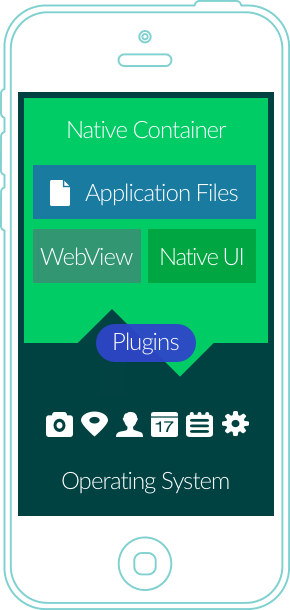

### Advantages of Hybrid Apps

- One codebase to manage
All the advantages of hybrid apps stem from the fact that, instead of building two apps, you’re building one app and simply tweaking it a bit so it works on both platforms.

With a hybrid app, you only have one codebase to manage.

- You save time and money
As you only have to manage one codebase, you’ll probably require half the number of developers two native apps would have required. Or, with the same number of developers, a hybrid app could be published in half the time.

In addition, hybrid app developers are often less expensive than native app developers.

- Easier to scale
Hybrid apps are easier to scale to another platform. Once you’ve built for one platform, you can launch on another like Windows Mobile.

You still have access to device features
As with native apps, hybrid apps let you retain the same ability to access device features.

This is thanks to solutions like PhoneGap that act like a bridge between the native SDK and the webview in which the app runs. We’ll talk about PhoneGap below.

- Built on web technology HTML/ CSS/ Javascript so it’s much easier to build
- Cheaper than a native app
- One app for all platforms using technology like Cordova
- No browser needed as opposed to a web app
- Have access to the device’s internal APIs, can access storage, camera, etc.
- Faster to develop than native apps because you have a single code base

### Disadvantages of Hybrid Apps
- Performance
Performance is probably the biggest disadvantage of hybrid apps.

Because hybrid apps load in a browser-like component called webview, they are only as good as the webview. Webview is responsible for displaying the UI and for running Javascript code.

In the early days of mobile, Google and Apple didn’t give webview the same engines used by their mobile browsers, Chrome and Safari. Since then, webview has vastly improved but it hasn’t reached native performance yet.

We will get deeper into different aspects of performance later in the article.

- Cross-platform development is tough
Getting your hybrid app to run appropriately on each platform generally takes substantial work.

In some situations, the total cost might become comparable to that of fully native apps, rendering the cost benefits negligible.

It all depends on how close you want to get to the “native user experience” or how simple your app is.

- The UX of the app will suffer
iOS and Android users tend to be very loyal to their platforms, and since they’ve been using them for years, they’re used to how things work in native apps.

The differences are subtle but can be frustrating for your app users.

By building a hybrid app, you won’t be able to please both camps. Try too hard to customize the app based on the platform and it may end up costing the same as two native apps.

There are some ways you can do this which we will discuss shortly.

- Slower than native apps
- More expensive than standard web apps because you have to work with the wrapper. Essentially you’re dependent on a third party platform

- Less interactive than native apps
- Customization will take you away from the hybrid model in which you may as well go native

### Hybrid App Platforms
- PhoneGap/Cordova
PhoneGap is probably the most well known among hybrid app platforms and probably the easiest to begin with for a web developer.

Cordova is the open source foundation and engine of PhoneGap. It’s backed by Adobe and is completely open source.

Cordova lets you create cross-browser mobile applications with Javascript, HTML, and CSS. These apps run in a WebView and are then wrapped in native code.

PhoneGap then offers native plugins that allow you to use all of the device’s functionality including the accelerometer, camera, compass, file system, microphone, media, networks, notifications, geolocation, and storage.

Apps need to be packaged into binary files which will include a webview wrapper and your app’s HTML files, normally loaded locally on the device.

Check out these PhoneGap apps: Tripcase (iOS / Android) and Untappd

- Canvas
Our own take on the hybrid app, Canvas is a service offering anyone with a mobile web app or responsive site the ability to build a mobile app for it, with no development work.

As with our News solution, Canvas is offered as a service, meaning we will build, publish and maintain your apps for you.

Technically, Canvas relies on our own native codebase for iOS and Android, including native elements for navigation such as a tab bar, a push notifications inbox, content preloading for your pages, caching, and offline support.

The app is designed to rely on a remote web app or mobile website which you control – any change on your mobile website is immediately reflected in the app. It’s a cost effective and high quality option for creating a mobile app for your website.

## How To Choose?

The decision to build either a web, native, or hybrid mobile app should be based on your business objectives. Before jumping into development, you should consider the following factors:

How fast you need the app
The quality of the user experience you want your app to have
The complexity of the features you need for your app to work
Your Budget

Whichever approach you choose should, above all, be quick, responsive, and reliable. As users are demanding more from mobile experiences, it’s important to keep up with their changing demands. Whichever app you decide to build, remember the following:

Your API infrastructure should have reliable and easy access to your content and services
A mobile app is not a replication of your website but an extension of your brand
Always get an understanding of your users’ expectations and behaviors and adapt as the market demands change

Finally, it’s important to work with an app development company that specializes in platform specific design and development.

Mobile development is a constantly moving target. Every six months, there’s a new mobile operating system, with unique features only accessible with native APIs. The containers bring those to hybrid apps soon thereafter, with the web making tremendous leaps every few years. Based on current technology, one of the scenarios examined in this article is bound to suit your needs. Let's sum those up in the following table:

We’ve given you a list of the advantages and disadvantages of web, native and hybrid mobile apps.

But how do you decide which one is best for you?

The following is a list of factors that should help you decide what kind of app to build.

- User Experience
User Experience (UX) is the overall experience a user has when using your product, especially in terms of how easy or pleasing it is.

A user interface is like a joke. If you have to explain it, it’s not that good. And if your app has bad UX, people will stop using it.

Needless to say, you need to invest in UX.

The best possible thing you can do for UX is to write two separate native apps for iOS and Android. Like we mentioned earlier, there are differences between the two operating systems and people have gotten used to them. If you hand an Android phone to a loyal iPhone user, chances are they’ll stumble a bit, and vice versa.

To see a list of the major differences between iOS and Android, click here.

- Time to market and cost
How much does building an app cost? There’s obviously a large range here. Prices will vary based on complexity, features, and platforms.

A quick way to get an estimate is to use this tool created by the fine people at Crew.  It asks a number of questions and gives you an estimate of how much your app will cost.

But essentially, your app development cost can be determined by just 2 factors: hours required to build and hourly cost. The hourly cost will stay mostly the same and is easy to determine, but the number of hours the app requires depends on what you need the app to do. Some of the major features you might need are covered in the tool created by Crew.

The best data about app development costs comes, unsurprisingly, from app development agencies. One such agency is The Nine Hertz. In 2016, they released this handy infographic.

There are a few important data points here so let’s go through them.

There are many different directions in which you can take your app, all of which have their pros and cons.

There will always be some kind of limitation of time or money that will push you to make a certain decision about your app.

What’s important is to spend enough time thinking and calculating before you start building.

Apps are expensive enough that you may only have one go at getting it right. Read as much as you can about the different kinds of apps and the development stages.

If you can, get in touch with people that have gone through the process of building each of these kinds of apps. They will be able to give you the best opinions.

What is clear, though, is that commercial success of smartphones and tablets isn’t showing any signs of slowing down.

So in the next few years, you can expect billions of people around the world to be getting their first smartphone.

The opportunity to get your app into the app store and into the hands of millions (or even billions) of people is still growing. Take it!

Now you have a better idea of how to build your app, let us take you through the app-building process – from market research to launch.

## References

1. [Android vs. iOS: Which smartphone platform is the best?](https://www.digitaltrends.com/mobile/android-vs-ios/)
2. [native app](https://searchsoftwarequality.techtarget.com/definition/native-application-native-app)
3. [What is a Hybrid Mobile App?](https://developer.telerik.com/featured/what-is-a-hybrid-mobile-app/)
4. ["Native, HTML5, or Hybrid: Understanding Your Mobile Application Development Options"](https://developer.salesforce.com/page/Native,_HTML5,_or_Hybrid:_Understanding_Your_Mobile_Application_Development_Options)
5. [A Guide to Mobile App Development: Web vs. Native vs. Hybrid](https://clearbridgemobile.com/mobile-app-development-native-vs-web-vs-hybrid/)
6. [Mobile App Vs. Mobile Website: Which Is The Better Option?](https://clearbridgemobile.com/mobile-app-vs-mobile-website-which-is-the-better-option/)
7. 